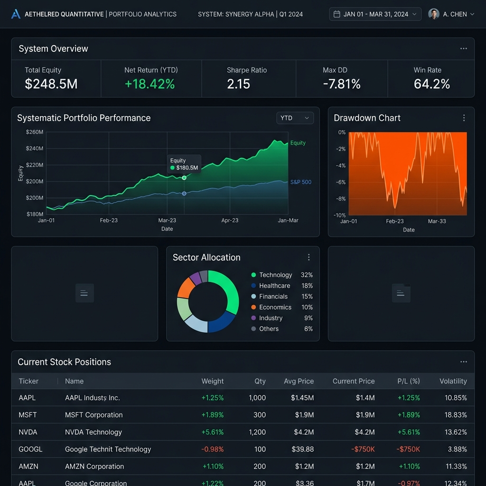
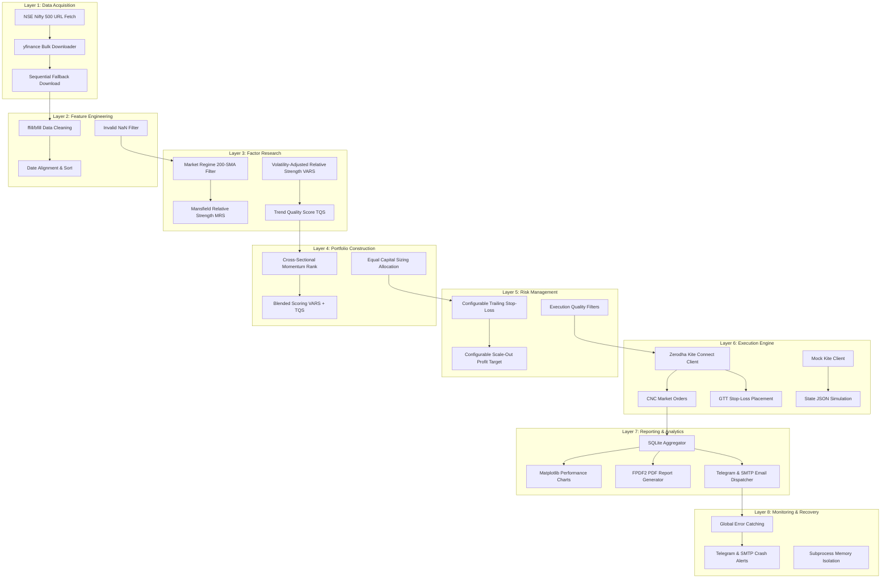
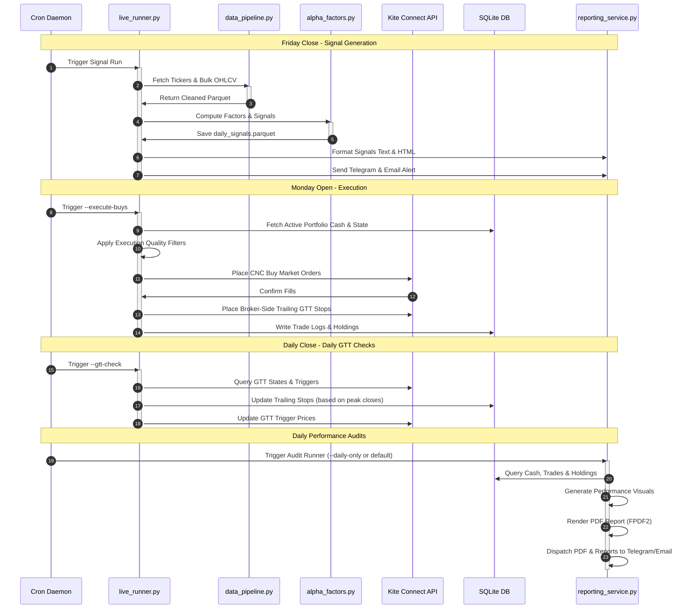

# Systematic Equity Trading Platform for Indian Markets

> Quantitative Research • Portfolio Construction • Risk Management • Automated Reporting



> **Project Scope:** This project was developed as an independent quantitative finance and software engineering initiative focused on systematic investing in Indian equity markets.

---

## Executive Summary

This project demonstrates the design and implementation of a production-oriented systematic investing platform for Indian equity markets. The system combines quantitative factor research, portfolio construction, execution automation, risk management, state reconciliation, and reporting infrastructure within a unified architecture.

---

## Technology Stack

| Category | Technologies |
|:---|:---|
| **Language** | Python |
| **Data Storage** | SQLite |
| **Market Data** | Yahoo Finance (yfinance API) |
| **Reporting** | FPDF2, Matplotlib, Seaborn |
| **Deployment** | AWS EC2, Cron |
| **Notifications** | Telegram, SMTP (Gmail App Passwords) |
| **Version Control** | Git, GitHub |

---

## Project Highlights

*   **Multi-Factor Selection Framework**: A cross-sectional ranking model combining price momentum, trend quality, and relative strength relative to a benchmark index.
*   **Regime-Aware Portfolio Allocation**: An integrated market trend filter that halts entries and liquidates holdings during bearish market regimes.
*   **Indian Market Frictions Modeling**: Realistic backtesting including Securities Transaction Tax (STT), brokerage fees, Depository Participant (DP) charges, GTT fee structures, slippage, and GST.
*   **Automated Audit Reporting**: Daily state synchronization with Telegram notifications and weekly PDF performance audits dispatched via SMTP.
*   **AWS Cloud Production Runner**: Automation scripts and cron scheduling guidelines optimized for long-term execution on cloud instances.
*   **Resilient Ingestion Pipeline**: Ingests historical data in bulk with a fallback scheduler querying missing assets sequentially.

---

## Engineering Highlights

*   **Subprocess Memory Isolation**: Runs signal generation inside isolated subprocesses to prevent memory fragmentation and ensure clean run environments.
*   **Database-Backed State Synchronization**: Automatically aligns the platform's SQLite database with backtest transaction logs on startup and executes daily state reconciliation.
*   **Broker-Side GTT Risk Execution**: Automatically synchronizes and updates trailing stop-loss orders directly via GTT (Good Till Triggered) on the broker's servers, eliminating execution dependencies on platform runtime uptime.
*   **Fail-Safe Crash Alerts**: Encompasses global exceptions tracking that dispatches immediate alerts with full tracebacks to SMTP and Telegram.
*   **Multi-Stage Containerization**: Provides a multi-stage `Dockerfile` to produce minimal-footprint, containerized execution environments.

---

## System Architecture

### 1. Layered Architecture Diagram
The platform is organized into eight distinct logical layers, separating concerns from data ingestion to recovery and reporting.



### 2. Execution Flow & Schedule
The platform execution sequence is orchestrated via cron jobs. The diagram below details the chronological processing flow.



---

## Trading Methodology & Factors

The platform implements a multi-factor systematic momentum strategy that selects assets based on weekly closing prices.

### 1. Market Regime Filter
To protect the portfolio from systemic market drawdowns, the platform evaluates a long-term moving average trend filter on the Nifty 500 benchmark index.
*   **Bullish Regime**: When the benchmark trades above its long-term moving average. Entry signals are processed normally.
*   **Bearish Regime**: When the benchmark falls below its long-term moving average. The platform halts new entries and liquidates existing long positions on the next market open.

### 2. Relative Strength Factor (Mansfield Relative Strength)
Relative Strength measures the performance of the asset relative to the benchmark index (Nifty 500). The Mansfield Relative Strength (MRS) factor evaluates the trend of this ratio using its moving average. The platform filters for stocks with a rising MRS trend, selecting assets that are actively outperforming the benchmark.

### 3. Volatility-Adjusted Momentum Factor (VARS)
The Volatility-Adjusted Relative Strength (VARS) factor ranks the universe based on risk-adjusted momentum. The returns are calculated using a lagged window (skipping the immediate past trading week) to prevent entering short-term mean-reversal traps, and normalized by rolling annualized volatility. This favors assets with stable, steady trends over high-volatility, chaotic spikes.

### 4. Trend Quality Factor (TQS)
The Trend Quality Score (TQS) filters out highly volatile trends that undergo painful drawdowns relative to their returns. It calculates the ratio of rolling returns to rolling maximum drawdowns. TQS filters for assets showing high return efficiency per unit of drawdown risk.

---

## Risk Management & Execution Controls

The execution engine incorporates risk management controls to enforce mathematical discipline. All threshold limits are completely configurable.

### 1. Concentrated Portfolio Construction
The platform splits available capital equally across a concentrated portfolio of top-ranked stocks, ensuring cash is fully deployed across the strongest momentum candidates.

### 2. Configurable Trailing Risk Controls
A trailing stop-loss is calculated daily for all active positions based on the asset's highest closing price recorded since its entry date. The SQLite database preserves this peak closing price historically from daily price parquets, ensuring the calculation remains immune to database resets.

### 3. Configurable Profit Harvesting Framework
To lock in gains during strong momentum runs, a scale-out mechanism triggers a partial sell order when a stock reaches a specified return threshold. The trailing stop-loss remains active on the remaining portion of the position.

### 4. Execution Quality Filters
To avoid execution slippage, the system evaluates opening gaps on execution day. If a stock's opening price gaps up significantly relative to the previous day's close, the buy order is skipped and the allocated cash is retained.

---

## Research & Validation

The platform's underlying strategy was validated through rigorous backtesting and quantitative research:
*   **Historical Walk-Forward Testing**: Evaluated performance using historical price datasets, avoiding look-ahead bias by executing rebalances strictly on subsequent open prices.
*   **Transaction Cost Modeling**: Accounted for real-world slippage and regulatory friction (STT, DP charges, GST, exchange fees) to estimate true net returns.
*   **Regime-Aware Evaluation**: Validated the effectiveness of the market regime filter in reducing portfolio drawdown during major historical market corrections.
*   **Portfolio Attribution Analysis**: Assessed factor performance contributions (VARS, MRS, TQS) to identify return drivers.
*   **Risk-Adjusted Performance Measurement**: Measured portfolio efficiency using Sharpe and Sortino ratios, comparing the results against a benchmark Buy & Hold strategy.

---

## Database Design

The platform uses a SQLite database (`data/live_state.db`) to manage live state. The schema details are described below:

### 1. Table: `portfolio_state`
Tracks the aggregate liquid capital and last synchronization time.
*   `cash` (REAL): Liquid cash available.
*   `last_updated` (TEXT): ISO 8601 timestamp of the last system sync.

### 2. Table: `holdings`
Represents open portfolio positions.
*   `ticker` (TEXT PRIMARY KEY): Yahoo Finance ticker symbol (e.g. `TCS.NS`).
*   `shares` (INTEGER): Number of active shares currently held.
*   `entry_price` (REAL): Average entry price of the position.
*   `entry_date` (TEXT): Date on which the position was opened.
*   `highest_close` (REAL): The maximum closing price recorded since entry (used for trailing stop).
*   `has_scaled_out` (INTEGER): Binary flag (1 if partial profit-take occurred, 0 otherwise).
*   `total_buy_cost` (REAL): Total cost including purchase frictions.
*   `partial_sell_proceeds` (REAL): Net cash proceeds received from scaling out.

### 3. Table: `trades`
Maintains historical execution logs.
*   `date` (TEXT): Execution timestamp.
*   `ticker` (TEXT): Asset ticker.
*   `action` (TEXT): Transaction type (`BUY`, `SELL`, `PARTIAL_SELL`).
*   `quantity` (INTEGER): Share quantity executed.
*   `price` (REAL): Gross price per share.
*   `friction` (REAL): Total calculated friction (brokerage, STT, DP, GST, slippage).
*   `net_value` (REAL): Net transaction cash impact.
*   `reason` (TEXT): Execution rationale (`NEW_SIGNAL`, `STOP_LOSS`, `PARTIAL_PROFIT`, `REBALANCE`, `MARKET_REGIME`).
*   `pnl_rs` (REAL): Realized profit/loss in INR.
*   `pnl_pct` (REAL): Realized percentage return on the position cost.

### 4. Table: `equity_history`
Maintains historical daily valuations for reporting.
*   `date` (TEXT PRIMARY KEY): Trading date.
*   `equity` (REAL): Total portfolio equity value (Holdings Value + Cash).
*   `cash` (REAL): Liquid cash balance at end-of-day.

---

## Production Readiness

*   **State Reconciliation**: On every run, the database parses transaction logs and recalculates holdings and cash to guarantee zero drift. It queries the daily price parquets to reconstruct the true peak price since the entry date.
*   **Mock Sandbox Client**: A local mock broker (`MockKiteClient` in `src/live_runner.py`) is provided to simulate GTT triggers and buy fills using a JSON state file (`data/test_gtt_state.json`) without hitting real brokerage endpoints.
*   **Process Monitoring & Logging**: Clean logs are separated into `logs/live_run.log`, `logs/reporting.log`, `data_pipeline.log`, and `factor_stack.log`.
*   **Security Measures**: Inbound ports are blocked. Outbound email and Telegram API endpoints use variables stored in a secure `.env` file locked to `chmod 600`.

---

## Skills Demonstrated

### Quantitative Finance & Trading
*   **Portfolio Construction & Sizing**: Managing capital allocation and equal weighting constraints.
*   **Quantitative Factor Modeling**: Designing and calculating mathematical filters (MRS, VARS, TQS) to rank asset universes.
*   **Risk Management Frameworks**: Designing trailing stop-losses, scale-out mechanisms, and regime filters to protect capital.
*   **Market Frictions Modeling**: Factoring in real-world taxes (STT), brokerage, and slippage to ensure backtest integrity.

### Software Engineering & Systems
*   **Relational Database Design**: Designing schemas and transactional tables in SQLite.
*   **Data Pipeline Engineering**: Constructing high-throughput data pipelines with API rate-limit resilience.
*   **Production Deployment**: Automating system setup on AWS EC2 VMs.
*   **Report Generation & Visualization**: Designing high-fidelity reporting systems (PDF, HTML, Telegram) with automated charting.
*   **Robust Exception Handling**: Designing global crash alert notifications with full traceback reporting.

---

## Sample Outputs

The platform's `src/reporting_service.py` creates several rich visualizations and analytical reports:

### 1. Weekly Performance PDF Report
Generated using custom-styled FPDF layouts:
```text
+-------------------------------------------------------------+
| QUANT QUANTITATIVE PERFORMANCE AUDIT                       |
| Generate Date: 2026-06-20                                   |
+-------------------------------------------------------------+
| PORTFOLIO SUMMARY                                           |
| - Total Equity:   Rs. 1,14,352.00                           |
| - Starting Cash:  Rs. 1,00,000.00                           |
| - CAGR:           29.41%                                    |
| - Max Drawdown:   -8.15%                                    |
| - Win Rate:       62.50%                                    |
+-------------------------------------------------------------+
| ACTIVE HOLDINGS                                             |
| Symbol      Qty   Entry Price   Highest Close   Current PnL |
| TCS.NS      12    Rs. 3,820.00  Rs. 4,110.00    +7.59%      |
| RELIANCE.NS 18    Rs. 2,410.00  Rs. 2,620.00    +8.71%      |
+-------------------------------------------------------------+
| Charts Included:                                            |
| - [Holdings Allocation Pie Chart (Cash vs Stock Weights)]   |
| - [Open Positions Return Bar Chart]                         |
| - [Daily Strategy Equity Curve vs Nifty 50 Benchmark]       |
+-------------------------------------------------------------+
```

### 2. Daily Telegram Performance Audit
Concise text broadcast dispatched automatically:
```text
📊 SWING PORTFOLIO DAILY AUDIT - 2026-06-20

• Total Portfolio Value: Rs. 1,14,352.00
• Cash Balance: Rs. 24,112.00 (21.08% weight)
• Active Position Count: 2

Active Positions:
1. RELIANCE.NS (18 Shares) | PnL: +Rs. 3,780.00 (+8.71%) [Scaled-Out]
2. TCS.NS (12 Shares) | PnL: +Rs. 3,480.00 (+7.59%)

Market Regime: BULLISH (Nifty 500 above 200 SMA)
```

---

## Directory Structure

```text
systematic-equity-trading-platform/
├── assets/
│   └── dashboard_mockup.png  # Generated dashboard banner preview
├── data/
│   ├── raw/
│   ├── processed/          # Parquet datasets and trade logs
│   ├── reports/            # Daily PDF reports and rendered charts
│   ├── fonts/              # Roboto font files
│   ├── live_state.db       # Main SQLite state manager database
│   ├── test_live_state.db  # Test database for verification runs
│   └── crontab             # Production cron scheduling guidelines
├── logs/                   # Log files for factor calculations, execution, and reporting
├── src/
│   ├── data_pipeline.py     # Resilient bulk yfinance downloader with sequential fallback
│   ├── alpha_factors.py     # Factor calculations (VARS, MRS, TQS, Max Drawdown)
│   ├── backtester.py        # Day-by-day portfolio simulator and execution rules
│   ├── analytics.py         # Matplotlib/Seaborn performance plotting engine
│   ├── reporting_service.py # SQLite aggregator, PDF generator, SMTP/Telegram client
│   ├── live_runner.py       # Production server entry-point and crash alert wrapper
│   ├── run_factor_stack.py  # Factor calculations CLI runner
│   ├── run_backtest.py      # Backtest simulator CLI runner (50k capital baseline)
│   └── run_backtest_1L.py   # Scaled capital simulator (50k vs 1L comparative runs)
├── setup_aws.sh             # Bash automation script for Ubuntu 24.04 EC2 setup
├── Dockerfile               # Multi-stage Docker config for containerized runs
├── requirements.txt         # Pip dependency list
└── .gitignore               # Exclude patterns
```

---

## Installation & Configuration

### 1. Prerequisites
Ensure you have Python 3.10+ and standard build tools installed.

### 2. Clone and Setup Environment
```bash
git clone git@github.com:omega3108/systematic-equity-trading-platform.git
cd systematic-equity-trading-platform
chmod +x setup_aws.sh
./setup_aws.sh
```

### 3. Set Up Environment Variables
Create a secure `.env` file in the project root:
```bash
# Telegram Configuration
TELEGRAM_BOT_TOKEN=YOUR_TELEGRAM_BOT_TOKEN
TELEGRAM_CHAT_ID=YOUR_TELEGRAM_CHAT_ID

# Email Configuration
EMAIL_ADDRESS=YOUR_EMAIL_ADDRESS
EMAIL_APP_PASSWORD=YOUR_EMAIL_APP_PASSWORD
SMTP_SERVER=smtp.gmail.com
SMTP_PORT=587

# Safety Toggle (True = Paper Trading simulation, False = Zerodha live CNC orders)
PAPER_TRADING_MODE=True
```
Restrict file access:
```bash
chmod 600 .env
```

---

## Usage Guide

The platform provides command-line flags to trigger specific operations:

### 1. Run Data Ingestion
Downloads 3 years of daily OHLCV data for all Nifty 500 constituents:
```bash
python src/data_pipeline.py
```
*   Use `--test` to fetch only 3 highly liquid benchmark stocks:
    ```bash
    python src/data_pipeline.py --test
    ```

### 2. Compute Factor Stack & Generate Signals
Calculates VARS, MRS, and TQS, and outputs trade signals:
```bash
python src/run_factor_stack.py
```
*   Use `--test` to process signals for test stocks:
    ```bash
    python src/run_factor_stack.py --test
    ```

### 3. Run Historical Backtest Simulators
Simulate performance of the multi-factor portfolio strategy over historical data:
```bash
# Baseline capital simulator
python src/run_backtest.py

# Scaled capital comparison run
python src/run_backtest_1L.py
```

### 4. Run Production Signals & Execution
*   **Weekly Signal Generation** (Runs Friday close to generate buy lists):
    ```bash
    python src/live_runner.py
    ```
*   **Order Execution** (Runs Monday open to execute market buys and set trailing stop-loss GTT orders):
    ```bash
    python src/live_runner.py --execute-buys
    ```
*   **Trailing Stop Updates** (Runs daily close to check highest close and update trailing trigger prices):
    ```bash
    python src/live_runner.py --gtt-check
    ```
*   **Test System Failure Alerts** (Verify that crash tracebacks are emailed and sent to Telegram):
    ```bash
    python src/live_runner.py --test-alert
    ```

### 5. Run Reporting & Performance Auditing
*   **Daily Audit** (Concise Telegram text alert of portfolio valuation):
    ```bash
    python src/reporting_service.py --daily-only
    ```
*   **Weekly Audit** (Generates performance charts, compiles high-fidelity PDF, and dispatches via Telegram + Email):
    ```bash
    python src/reporting_service.py
    ```

---

## Future Improvements

*   **Live Broker Integrations**: Adding APIs for other discount brokers (Groww, Dhan, Angel One).
*   **Multi-Asset Class Support**: Expanding factor universe to trade ETFs, commodities, and index options.
*   **Portfolio Optimization Engine**: Incorporating Mean-Variance Optimization (MVO), Black-Litterman, or Risk-Parity models instead of basic equal-weight allocation.
*   **Advanced Factor Research**: Researching short-term mean reversion and liquidity-shock alpha factors.
*   **Machine Learning Overlays**: Applying meta-labeling techniques (using decision trees or XGBoost) to predict signal execution success probabilities.

---

## Disclaimer

This platform is developed for educational and portfolio demonstration purposes only. Systematic trading involves substantial risk of loss. Past performance is not indicative of future results. No component of this platform constitutes financial or investment advice.
